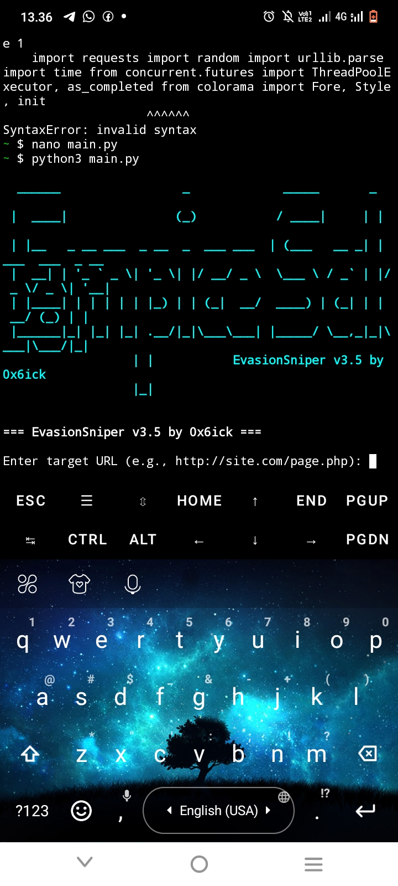

<!DOCTYPE html>
<html lang="en">
<head>
  <meta charset="UTF-8" />
  <meta name="viewport" content="width=device-width, initial-scale=1.0"/>
  <title>EvasionSniper | By 0x6ick</title>
  
</head>
<body>

  <h1>EvasionSniper</h1>
  
<strong>Brutal SQLi Payload Sniper with WAF Bypass</strong> 
  By <a href="https://github.com/6ickzone" target="_blank">0x6ick</a>

  <h2>Deskripsi</h2>
  
EvasionSniper adalah alat sniper SQL injection otomatis yang dirancang untuk <strong>menembus proteksi WAF (Web Application Firewall)</strong> dengan payload brutal dan teknik evasion cerdas. Dilengkapi fitur auto-detect, multi-threading, dan auto-save hasil scan.

  <h2>Fitur Unggulan</h2>
  <ul>
    <li>Multi-threaded payload launcher</li>
    <li>Deteksi WAF otomatis & auto-bypass</li>
    <li>Randomized User-Agent & delay injection</li>
    <li>ASCII banner keren & output berwarna</li>
    <li>Simpan hasil scan otomatis (<code>vuln.txt</code>, <code>suspect.txt</code>, <code>hasil.txt</code>)</li>
  </ul>

  <h2>Instalasi</h2>
  <pre><code>git clone https://github.com/6ickzone/EvasionSniper.git
cd EvasionSniper
pip install -r requirements.txt</code></pre>

  <h2>Penggunaan</h2>
  <pre><code>python main.py -t targetlist.txt</code></pre>

  
<strong>Opsional Flags:</strong>

  <ul>
    <li><code>-t</code> : Path file berisi list target</li>
    <li><code>-w</code> : Jumlah worker/thread</li>
    <li><code>-d</code> : Delay antar payload</li>
    <li><code>--bypass</code> : Aktifkan mode bypass WAF</li>
  </ul>

  
Contoh:

  <pre><code>python main.py -t list.txt -w 10 -d 1 --bypass</code></pre>

  <h2>Struktur File</h2>
  <ul>
    <li><code>main.py</code> : Core engine & launcher</li>
    <li><code>Payload.txt</code> : Kumpulan payload SQLi evasion</li>
    <li><code>requirements.txt</code> : Modul Python yang dibutuhkan</li>
    <li><code>hasil.txt</code> : Semua target yang diuji</li>
    <li><code>suspect.txt</code> : Target dengan potensi vulnerability</li>
    <li><code>vuln.txt</code> : Target yang confirmed SQL injection</li>
  </ul>

  <h2>Screenshot</h2>
  

  <h2>Catatan Developer</h2>
  
Project ini masih terus dikembangkan. Feedback, pull request, atau tambahan payload sangat diterima.

  <h2>⚠️ Disclaimer</h2>
  <blockquote>
    <strong>EvasionSniper is built for educational purposes and authorized penetration testing only.</strong> 
    Using this tool for illegal activities violates ethical hacking principles and may be punishable by law.
  </blockquote>

  

  
<em>Build with mindset:</em> 
  <strong>"Bypass the wall, own the gate." — 0x6ick</strong>

</body>
</html>
